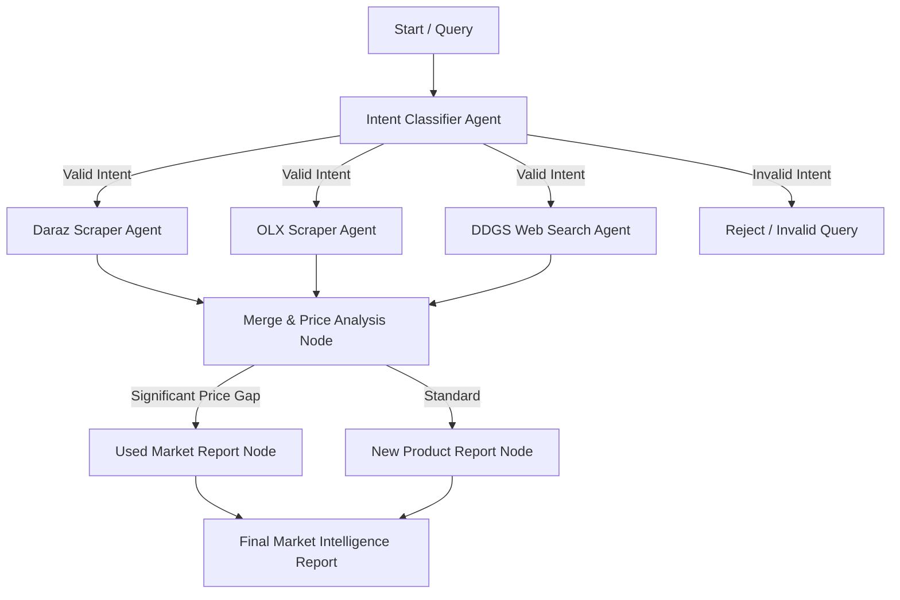

<<<<<<< HEAD
# marketlens
AI-powered product research agent that scrapes Daraz, OLX, and the web (DDGS), analyzes prices, compares new vs. used markets, and generates a final intelligence report 
=======
# MarketLens 🔍

**MarketLens** is an AI-powered e-commerce research & price intelligence platform built with **FastAPI**, **LangGraph**, **LangChain**, and web scrapers (**Playwright**, **DDGS**).

It autonomously searches multiple marketplaces (e.g. **Daraz**, **OLX**, and the wider web), analyzes new vs. used product listings, evaluates price gaps, and generates actionable market intelligence reports streamed live via Server-Sent Events (SSE).

---

## 🌟 Key Features

- **Multi-Source Scraping**: Collects product data, prices, and listings in parallel from Daraz, OLX, and DuckDuckGo Search.
- **Intent Classification**: Evaluates search queries for valid product intent before triggering scrapers.
- **AI Market Analysis**: Uses LLM agents to synthesize price trends, highlight price gaps, and provide a value verdict.
- **LangGraph Workflow**: Directed acyclic workflow orchestrating intent validation, scraping, merging, and report generation.
- **Real-Time SSE Streaming**: Live updates broadcasted to the frontend as each pipeline step executes.
- **Modern UI**: Interactive web interface for running product queries and reading generated reports.

---

## 🏗️ Architecture & Workflow



---

## 🚀 Getting Started

### Prerequisites

- Python 3.10+
- Node.js / Playwright browser binaries
- Groq API Key (or supported LLM backend)

### Installation

1. **Clone the repository:**
   ```bash
   git clone git@github.com:Nabos23/marketlens.git
   cd marketlens
   ```

2. **Create and activate a virtual environment:**
   ```bash
   python -m venv .venv
   # Windows
   .venv\Scripts\activate
   # Linux / macOS
   source .venv/bin/activate
   ```

3. **Install dependencies:**
   ```bash
   pip install -r requirements.txt
   ```

4. **Install Playwright browsers:**
   ```bash
   playwright install chromium
   ```

5. **Configure environment variables:**
   Copy `.env.example` to `.env` and set your preferred provider and API key:
   ```env
   # Provider: 'openai' or 'groq'
   LLM_PROVIDER=openai

   # OpenAI Settings
   OPENAI_API_KEY=your_openai_api_key_here
   OPENAI_MODEL=gpt-4o-mini

   # Groq Settings (Alternative)
   GROQ_API_KEY=your_groq_api_key_here
   GROQ_MODEL=llama-3.3-70b-versatile
   ```

---

## 🏃 Running the Application

### Start Backend API Server
```bash
uvicorn main:app --reload --port 8000
```
The API server will run at `http://127.0.0.1:8000`.

### Open Frontend Interface
Open `index.html` directly in your browser, or serve it using any HTTP server:
```bash
python -m http.server 3000
```
Navigate to `http://localhost:3000` to start using MarketLens.

---

## 📁 Project Structure

```
marketlens/
├── agents/
│   ├── Analysis/       # Data merging & price gap analysis nodes
│   ├── DARAZ/          # Daraz scraper agent & prompts
│   ├── DDGS/           # DuckDuckGo search agent & prompts
│   ├── OLX/            # OLX listings scraper agent & prompts
│   ├── intent/         # Search query intent classifier
│   ├── report/         # Final report generator nodes
│   ├── tools/          # Playwright & search tool implementations
│   └── workflow.py     # LangGraph workflow graph definition
├── config.py           # LLM configuration (Groq)
├── state.py            # LangGraph state schema (Product_Info)
├── routes.py           # FastAPI SSE endpoints
├── main.py             # FastAPI entry point & CORS configuration
├── index.html          # Web UI interface
├── requirements.txt    # Project dependencies
└── README.md           # Documentation
```

---

## 📄 License

Distributed under the MIT License. See `LICENSE` for more information.
>>>>>>> dev-soban
